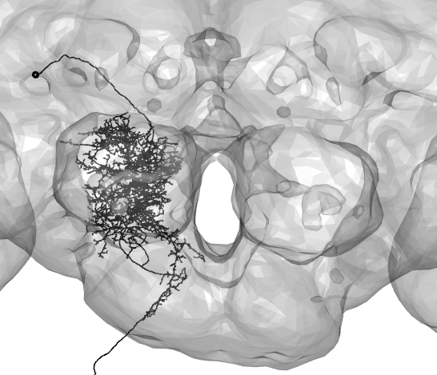
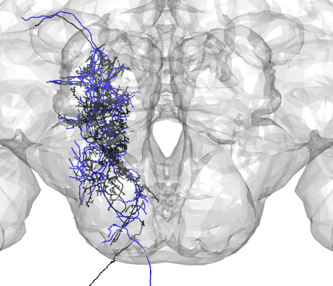
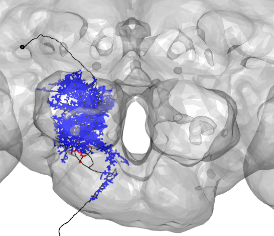
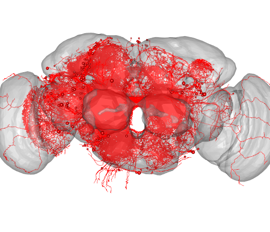
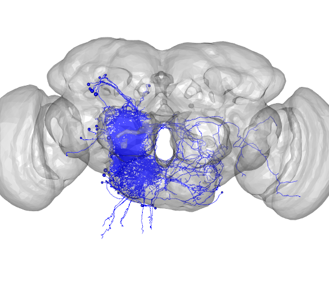
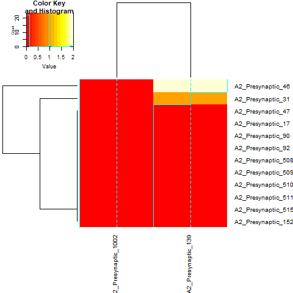
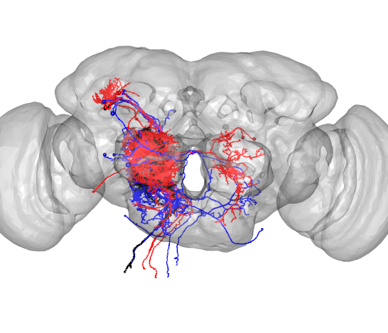

```{r setup, include=FALSE}
knitr::opts_chunk$set(echo = TRUE)
library(knitr)
library(rgl)
knit_hooks$set(webgl = hook_webgl)
source('nat-startup.R')
```
```{r global_options,include=FALSE}
knitr::opts_chunk$set(warning=FALSE, message=FALSE)
```


The main natverse tools that exist for working with FAFB data are [catnat](https://jefferislab.github.io/catnat/reference/index.html), [rcatmaid](http://natverse.org/rcatmaid/reference/index.html), and [elmr] http://natverse.org/elmr/index.html


To access v14 FAFB data using R, you first need to establish a catmaid connection
```{r login,echo=TRUE,results='hide',message=FALSE,warning=FALSE,eval=FALSE}
catmaid_login(server="https://neuropil.janelia.org/tracing/fafb/v14/",authname='fly',authpassword='superfly',token="yourtokenhere")
```
```{r login_function, include=FALSE}
catmaid_login(server="https://neuropil.janelia.org/tracing/fafb/v14/",authname='fly',authpassword='superfly',token="cecd262c43ce5c1a9166fc65b9ea3d25464b1150")
rotationMatrix=rbind(c(1,0,0,0),c(0,-1,0,0),c(0,0,-1,0),c(0,0,0,1))
windowRect=c(1221,231,1767,700)
```

<font size=5> Fetch Neurons from FAFB </font>

Provide the skeleton ID of the desired neuron in v14 to fetch the skeleton and read it as a neuron object
```{r,echo=TRUE,results='hide',message=FALSE,warning=FALSE,eval=FALSE}
DNa02=read.neurons.catmaid(12526673)
open3d(userMatrix=rotationMatrix,windowRect=windowRect,zoom=0.33)
plot3d(DNa02,soma=TRUE,lwd=2,col='black',WithNodes=FALSE)
plot3d(FAFB)
```


<font size=5> Compare with neurons in other brain spaces</font>

Skeletons fetched from v14 are registered to the template brain called <b>FAFB</b>. To compare with neurons in other brain spaces, these neuron objects can be transformed using <b>xform_brain</b>. For example, here a neuron traced from a ligh-level image(in blue) is compared with a skeleton fetched from FAFB(in black).

```{r,echo=TRUE,results='hide',message=FALSE,warning=FALSE,eval=FALSE}
Namiki_tracing_1 <-read.neuron('data/Namiki_tracing_registered.swc')
Namiki_tracing_FCWB<-xform_brain(Namiki_tracing_1,sample=JFRC2013,reference=FCWB)
```
```{r,echo=TRUE,results='hide',message=FALSE,warning=FALSE,eval=FALSE}
#transform neuron into FCWB template brain space 
A2_EM_FCWB<- xform_brain(DNa02,sample=FAFB, reference = FCWB)

#plot together with light-level tracing
open3d(userMatrix=rotationMatrix,windowRect=windowRect,zoom=0.33)
plot3d(A2_EM_FCWB,lwd=2,col="black",WithNodes=FALSE)
plot3d(Namiki_tracing_FCWB,lwd=2,col="blue",WithNodes=FALSE)
plot3d(FCWB)
```


<font size=5> Find synapses</font>

To get the locations of synapses made by your neuron of interest, use [get_synapses](https://jefferislab.github.io/catnat/reference/get.synapses.html): 

```{r,echo=TRUE,results='hide',message=FALSE,warning=FALSE,eval=FALSE}
DNa02_presynapses=get.synapses(DNa02,target=c("PRE"))
DNa02_postsynapses=get.synapses(DNa02,target=c("POST"))

#plot synapse locations with neuron 
open3d(userMatrix=rotationMatrix,windowRect=windowRect,zoom=0.33)
plot3d(DNa02,lwd=2,col='black',withNodes=FALSE,soma = TRUE)
points3d(DNa02_presynapses, col = "red", lwd = 10)
points3d(DNa02_postsynapses, col = "blue", lwd = 2)
plot3d(FAFB)
```


Synapses can be grouped based on brain region using [inside_neuropils](https://jefferislab.github.io/catnat/reference/inside_neuropils.html)

```{r,echo=TRUE,results='hide'}
DNa02=read.neurons.catmaid(12526673)
```
First, grouping the presynaptic partners of our neuron by brain region, we get: 
```{r, echo=TRUE}
#Note: here the 'POST' tag indicates that our neuron is postsynaptic to the input neurons being found 
pre_neuropils = inside_neuropils(DNa02,brain = FAFB14NP.surf, "POST")
pre_neuropils
```
Next,grouping the postsyanptic partners of our neuron by brain region, we get:
```{r, echo=TRUE}
#Note: here the 'PRE' tag indicates that our neuron is presyanptic to the output neurons being found 
post_neuropils= inside_neuropils(DNa02,brain = FAFB14NP.surf, "PRE")
post_neuropils
```
Plotting the results of this analysis using a barplot
```{r,echo=TRUE,results='hide',message=FALSE,warning=FALSE,eval=FALSE}
pre_neuropils_df=data.frame(names=names(pre_neuropils$`12526673`),counts=as.numeric(unlist(pre_neuropils)))
pre_neuropils_df=subset(pre_neuropils_df,counts>0)
post_neuropils_df=data.frame(names=names(post_neuropils$`12526673`),counts=as.numeric(unlist(post_neuropils)))
post_neuropils_df=subset(post_neuropils_df,counts>6)
all_neuropils_df=merge(pre_neuropils_df,post_neuropils_df,by='names',all=TRUE)
all_neuropils_df.m=melt(all_neuropils_df, id.vars='names')
all_neuropils_df.m=all_neuropils_df.m[order(-all_neuropils_df.m$value),]
all_neuropils_df.m$Groups <- factor(all_neuropils_df.m$names, levels = all_neuropils_df[order(all_neuropils_df$counts.x),]$names)
ggplot(all_neuropils_df.m,aes(fill=variable,x=Groups,y=value))+geom_bar(stat="identity")+
  coord_flip()+theme_bw()+scale_x_discrete(name ="Region")+ ylab('Synapse Count')+theme(legend.position="none")+scale_fill_manual(values=c("red","blue"))
```


<font size=5> Get synaptic partners</font>

We can also fetch the skeletons of the synaptic partners
```{r,echo=TRUE,results='hide',message=FALSE,warning=FALSE,eval=FALSE}
synaptic_partners=catmaid_query_connected(12526673)
presynaptic_partners=read.neurons.catmaid(synaptic_partners$incoming['partner'][,],OmitFailures = T)
postsynaptic_partners=read.neurons.catmaid(synaptic_partners$outgoing['partner'][,],OmitFailures = T)
```
Plot <span style="color:red"> presynaptic partners </span>

```{r,echo=TRUE,results='hide',message=FALSE,warning=FALSE,eval=FALSE}
open3d(userMatrix=rotationMatrix,windowRect=windowRect,zoom=0.6)
plot3d(presynaptic_partners,col='red',lwd=1,soma=TRUE)
plot3d(FAFB)
```


Plot <span style="color:blue"> postsynaptic partners </span>

```{r,echo=TRUE,results='hide',message=FALSE,warning=FALSE,eval=FALSE}
open3d(userMatrix=rotationMatrix,windowRect=windowRect,zoom=0.6)
plot3d(postsynaptic_partners,col='blue',lwd=1,soma=TRUE)
plot3d(FAFB)
```


<font size=5> Evaluate neuron connectivity </font>

In this example, we evaluate the connectivity between two classes of neurons and plot the resutls as a heatmap. In this visualization, the values are synaptic weights and row and column names are neuron names from CATMAID

```{r,echo=TRUE,results='hide',message=FALSE,warning=FALSE,eval=FALSE}
#read in first class of neurons 
PFL3_neuron_ids=c(12526784,12526732,12526393,12526785,12526661,12526663,12526731,12526733,
                  12526734,12526735,12526738,12526894)
PFL_3_neurons=read.neurons.catmaid(PFL3_neuron_ids)

#read in second class of neurons 
DN_neuron_ids=c(12526591,12526791)
DN_neurons=read.neurons.catmaid(DN_neuron_ids)

#generate connectivity matrix 
connectivity_matrix=skeleton_connectivity_matrix(PFL_3_neurons,DN_neurons)
gplots::heatmap.2(x=connectivity_matrix,cexRow=1,cexCol=1,margins = c(9, 9))
```


<font size=5> Find the number of synapses per connection </font>

Each synaptic connection has a unique <b>connector_id</b>. Here, we find all incoming and outgoing partners of our neuron of interest, and list the partners with the greatest numbers of synaptic connections. The top incoming partners(red), the top outgoing partners(blue), and our neuron of interest(black) are plotted below.

```{r,echo=TRUE}

#get all connections 
connector_table=data.table(catmaid_get_connector_table(12526673))

#count the number of connections for synaptic partner 
incoming_connector_counts=connector_table[connector_table$direction=='incoming'][, .N, by=.(partner_skid)]
outgoing_connector_counts=connector_table[connector_table$direction=='outgoing'][, .N, by=.(partner_skid)]

#display the 10 synaptic partners with the greatest number of conections 
incoming_connector_counts[order(-N)][1:10]
outgoing_connector_counts[order(-N)][1:10]
```
